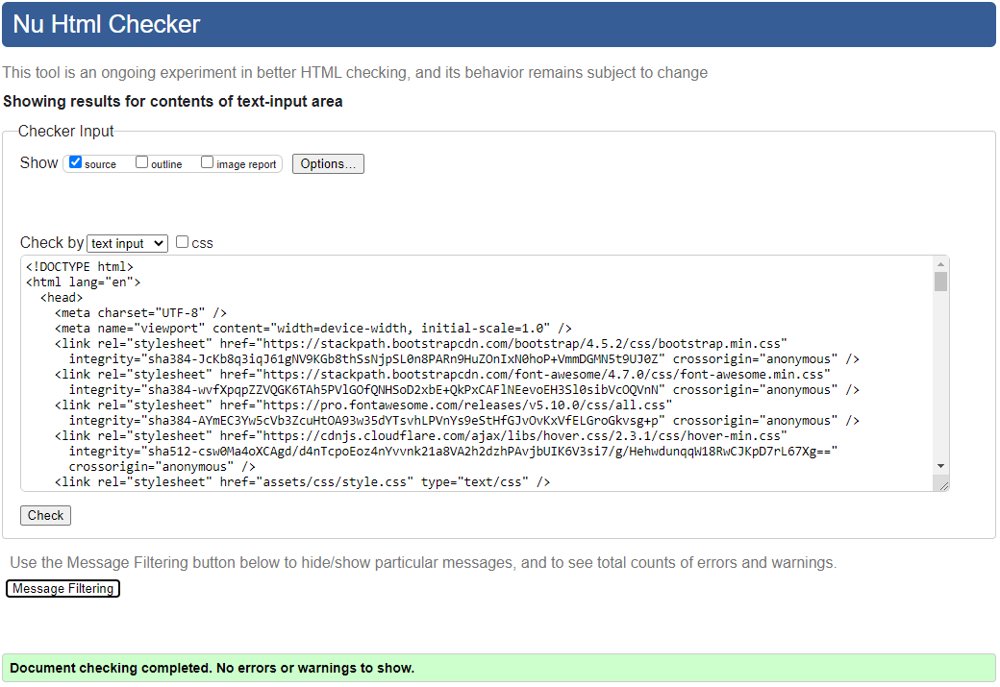
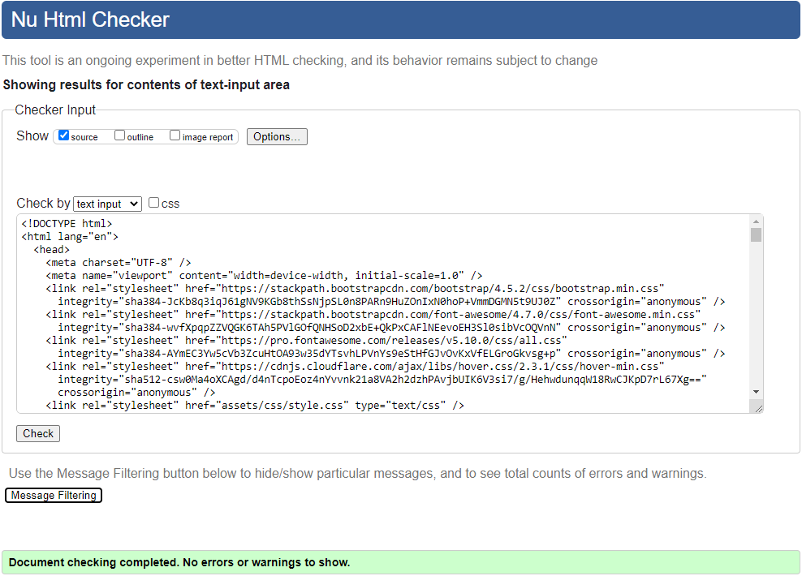
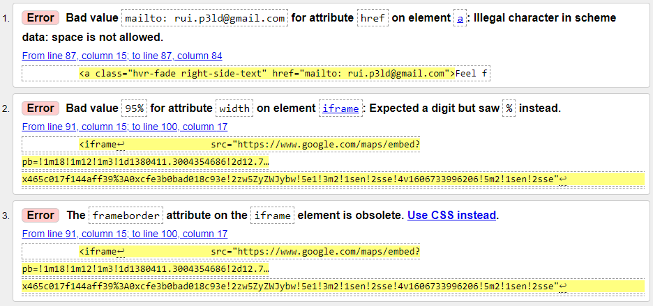
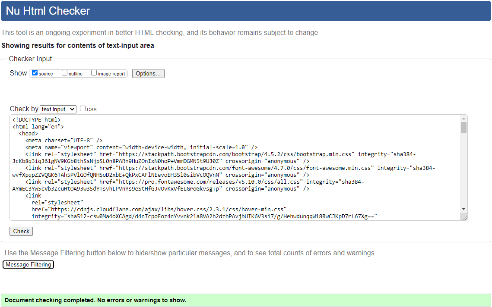
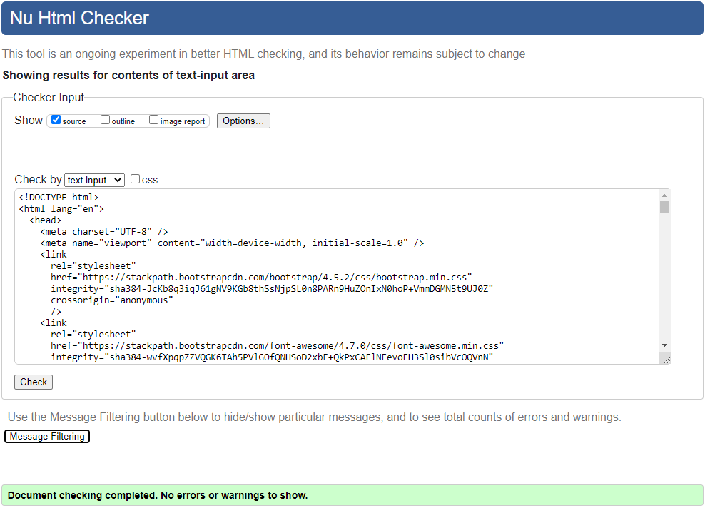
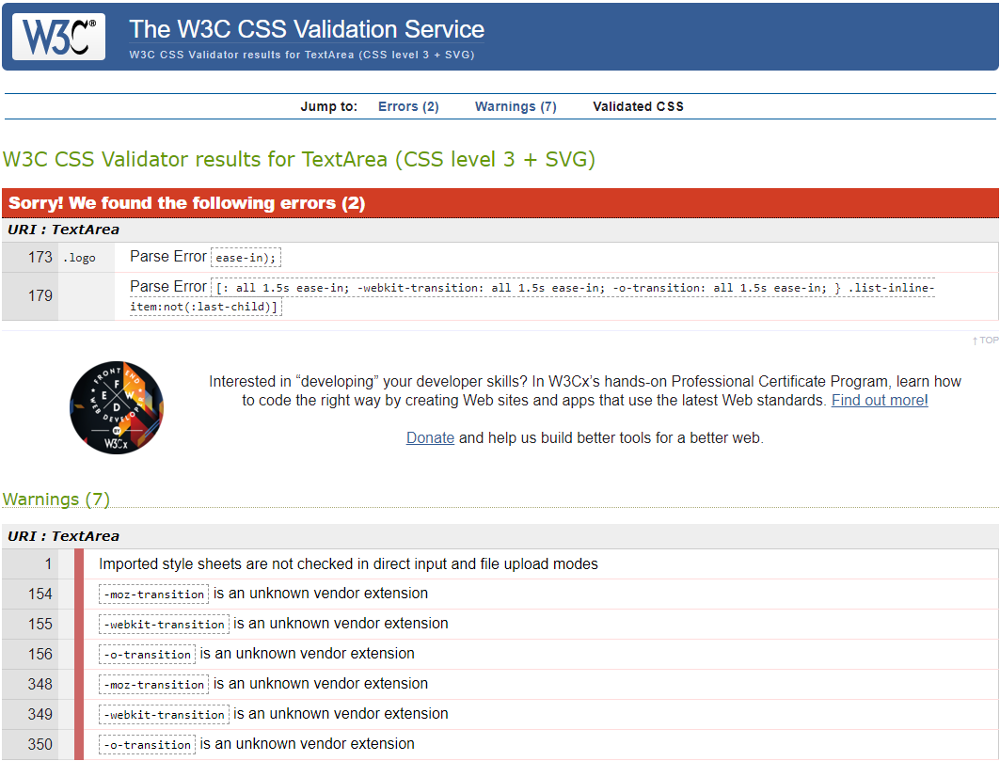
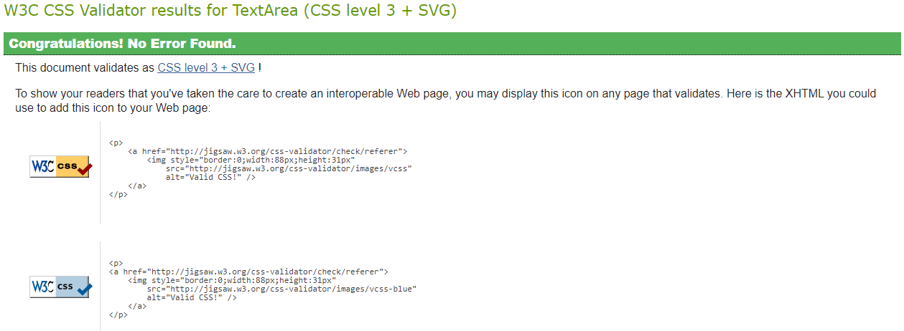
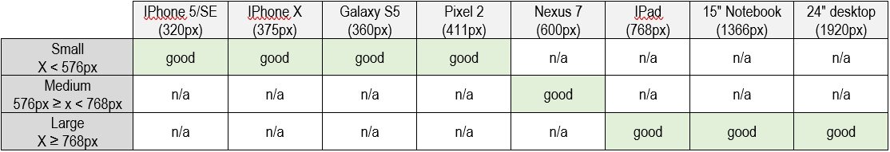

# [Rui Oliveira](https://ruioliveira83.github.io/MP1)

This is a website with my portfolio.
In this website, I will display my projects, especially my four milestone projects
for the diploma in software development from the [code institute](https://codeinstitute.net).

---

## UX

This website is a place to show my portfolio and to introduce myself to potential clients.
As a developer, I wanted to use and test what I learn in the course so far.
As a user, I'll be able to:

- get to know Rui Oliveira, his education and what he does;
- see and access Rui's portfolio;
- contact Rui Oliveira;
- download Rui's CV.

It was used [Balsamiq](https://balsamiq.com/) to create the following wireframes:

| Desktop                                       | Tablet                                       | Mobile                                       |
| --------------------------------------------- | -------------------------------------------- | -------------------------------------------- |
| [Home](wireframes/home-desktop.png)           | [Home](wireframes/home-tablet.png)           | [Home](wireframes/home-mobile.png)           |
| [Portfolio](wireframes/portfolio-desktop.png) | [Portfolio](wireframes/portfolio-tablet.png) | [Portfolio](wireframes/portfolio-mobile.png) |
| [Contact](wireframes/contact-desktop.png)     | [Contact](wireframes/contact-tablet.png)     | [Contact](wireframes/contact-mobile.png)     |
| [Resume](wireframes/resume-desktop.png)       | [Resume](wireframes/resume-tablet.png)       | [Resume](wireframes/resume-mobile.png)       |

---

## Features

### Existing Features

This website has 4 pages: **Home**, **Portfolio**, **Contact** and **Resume**. All pages share the same **Header** and **Footer**.

The **Header** has 3 sections:

- a photo with a link to the home page;
- name and title;
- navigation bar with links to the 4 pages of this website.

The **Footer** has a link to easily download the cv.

The **Home** page includes a section with personal information and a section with What I do, How do I do it and Why hire me.

The **Portfolio** page includes Rui's Portfolio. On the left side of the page, we have a list of projects  
with a link to the section of the page related to that project. On the right side of the page, there is a description
of each project with a link to that project.

The **Contact** page includes a section with personal information, a section with a link that allows the user
to send me an email and a section with a map showing my location.

The **Resume** page includes a summary, my work history, my education and my skills.

### Features Left to Implement

Add links to future projects on the Portfolio page.

Add a contact form to allow users to send a message directly, without using their email.

---

## Technologies Used

- [Gitpod](https://gitpod.io/)
  - IDE (Integrated Development Environment) used to develop this project.
- [GitHub](https://github.com/)
  - The code hosting platform used to host the project.
- [HTML5](https://en.wikipedia.org/wiki/HTML5)
  - The programming language used to provide content and structure.
- [CSS3](https://en.wikipedia.org/wiki/CSS)
  - The programming language used to format the styling.
- [Balsamiq](https://balsamiq.com/)
  - The software used to create the project's wireframes.
- [Bootstrap](https://getbootstrap.com/)
  - Open-source CSS framework used to create some layout features in the project.
- [Google Fonts ](https://en.wikipedia.org/wiki/CSS)
  - Font families library used to provide the fonts "Roboto" and "Nunito".
- [Font Awesome](https://fontawesome.com/)
  - Font and icon toolkit based on CSS and Less used to add some icons to the project.
- [W3C Markup Validator](https://validator.w3.org/)
  - The markup validation service used to check for errors in the HTML code.
- [Jigsaw](https://jigsaw.w3.org/css-validator)
  - The CSS validation service used to check for errors in the CSS code.
- [Chrome DevTools](https://developers.google.com/web/tools/chrome-devtools)
  - Chrome DevTools used to test the responsiveness of the site.
- [Responsive Design Checker](https://www.responsivedesignchecker.com/)
  - Responsive Design Checker used to test the responsiveness of the site.

---

## Testing

### Code Validators

- [HTML Validator](https://validator.w3.org/#validate_by_input) (via direct input path):

  - Home (index.html) - No errors or warnings.
  
  - Portfolio (portfolio.html) - No errors or warnings.
  
  - Contact (contact.html) - 3 errors found:
  
  1. The first error was due to an additional space added after "mailto:". That space was deleted to eliminate the error.
  2. The second was due to the value of 95% for the width attribute on the iframe element. This attribute was deleted and the width of this element is now controlled in the style.css file.
  3. The third error was due to the use of the frameborder attribute. This attribute was deleted to eliminate the error.  
After amending these errors the found no errors or warnings:

  - Resume (resume.html) - No errors or warnings.
  

- [CSS Validator](https://validator.w3.org/#validate_by_input) (via direct input path):

  - There were 2 errors and 7 warnings on the css:

1. The 2 errors were caused by an extra round bracket. It was deleted to solve the errors.
2. the first warning is related to the imported google fonts stylesheet.
3. all the other errors were due to the use of unknown vendor extensions. All those extensions were deleted.  
After amending the error no errors were found:

### Responsiveness of website
It was used [Chrome DevTools](https://developers.google.com/web/tools/chrome-devtools) and
[Responsive Design Checker](https://www.responsivedesignchecker.com/)
 to test the responsiveness of the site.

The responsiveness of all pages was tested:
- all the links are working;
- the cv download on the footer is working;
- the email me option is working and opens the email;
- all the images are rendering;
- the website structure adapts well to the used screen size. On a first version of the website, the home 
and contact page didn't have enough content to occupy the full screen in larger displays. That wasn't 
looking good and was solved by adding more content and presenting the content differently.

### Browser compatibility

The website was tested in 5 different web browsers: Internet Explorer, Microsoft Edge,
Mozilla Firefox, Google Chrome and Opera.
The internet explorer wasn't displaying/recognizing the colour #0000009e. This colour was changed to #44474a to solve the problem.
After this changed the website is working properly in all tested browsers.

---

## Deployment

To __deploy__ the project in GitHub I perform the following steps:
- Log into my [GitHub](https://github.com/) account;
- Choose the project "MP1" on the Repositories;
- Click on Settings;
- Scroll down to the "GitHub Pages" section;
- Inside the "GitHub Pages" section, click on the drop-down menu under Source and select Master Branch;
- The page refreshes automatically and the website is now deployed.
- The link to the webpage can be found in the GitHub Pages section.

To run the code locally by __cloning__ the project from GitHub:
- Log into my [GitHub](https://github.com/) account;
- Choose the project "MP1" on the Repositories;
- Inside the Code button copy the URL link inside the Clone section;
- Open repository or create a new repository;
- Open terminal;
- Type *git clone* followed by the copied URL and press Enter.

---

## Credits

### Content

- Home Page:
  - The text was taken from the [code institute](https://codeinstitute.net) mini project with bootstrap 4.
- Portfolio Page:
  - The description of the Milestone projects was taken from the [code institute](https://codeinstitute.net).
- Overall structure:
  - I was inspired by the miniproject with bootstrap 4.
- Read me file:
  - I used the code institute template and took some ideas from [karzuin](https://github.com/karzuin/) and [Fernanda Gil](https://github.com/fernandagil) read me files.

### Media

- Header:
  - The photo used in this site was taken by me.
- Contact Page:
  - The map is from [google maps](https://www.google.com/maps).

### Acknowledgements

- The [code institute](https://codeinstitute.net) for the inspiration and knowledge to do this website.
- The code institute [Slack](https://slack.com/) channel, for having an extensive library of questions and answer with almost all my questions.
- My mentor [Precious Ijege](https://www.linkedin.com/in/precious-ijege-908a00168/?originalSubdomain=ng) for guidance and support.